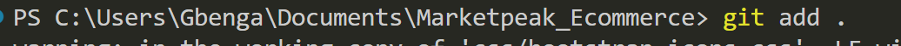
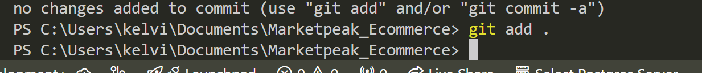
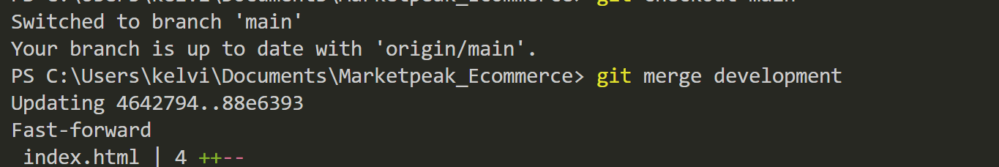

# Project title : Introduction to cloud computing

## Implement version control with GIT

1.1 Initialize repository

  ```bash
  mkdir Marketpeak_Ecommerce
  
  cd Marketpeak_Ecommerce
  git init
  ```


1.2 Obtain and prepare the  E-Commerce website template

To download an HTML template from Tooplate, follow these steps:

Visit Tooplate's Website:

Open your browser and go to Tooplate's official website.
Browse the Templates:

Explore the various HTML templates available. You can navigate through different categories or use the search bar to find a specific template.
Select a Template:

Once you find a template you like, click on it to view more details. This will take you to the template's dedicated page, where you can preview the design.
Download the Template:

On the template page, look for the "Download" button (usually located under the preview or near the title). Click on the "Download" button.
Save the File:

A ZIP file containing the HTML template will start downloading. Save it to your desired location on your computer.
Extract the ZIP File:

After downloading, locate the ZIP file on your computer, right-click on it, and select "Extract" (or use a ZIP file extractor if necessary).
You will now have access to the full template files, including HTML, CSS, JavaScript, and any other assets included.
You can now open the extracted HTML files and customize the template according to your needs!  

1.3 Stage and commit the template to GIT

- To stage the template to git, you will need to first configure git if you have done so by running  
  `git config --global user.name "your name"`  
  `git config --global user.email "your email"`
  
  
  After configuring git  
  run `git add .` to add web template to git staging area  
  
  run `git commit -m "Add a commit message"` to commit the message to git history  
  

1.4 Push the code to Git remote repository
  After committing the code to git , you can push it to the remote repository by doing the following:  

- Login into your github account
- Create a new repository named Marketpeak_Ecommerce  
- Leave the repository empty without initializing with README.md
- Add the remote repository url to your local repository
  
- push the code to the remote repo by running  
  `git push origin main`  

2.0 AWS Deployment

- Login to AWS managment console
    
2.1 Setup an AWS EC2 instance
- Launch EC2 instance
- Connect to EC2 instance


2.2 Clone the repository on the Linux Server
  Before deploying the e-commerce platform, we would need to clone the github repository to our AWS EC2 instance. This process involves authenticating with Github and choosing between two primary methods of cloning a repository i.e SSH and HTTPS  

- Setup Git on amazon-linux vm  
  [](./screenshots/11.settingup_git_on_amazon_linux.png)
  
- Seetting up SSH KEY
  
- Generate SSH key
    
- Display and copy the SSH Key  
  `cat /home/ubuntu/.ssh/id_rsa.pub`  
  
- Add SSH Key to you Github account for access
  
- clone the repo to Amazon-Linux by copying the code:  
  `git clone git@github.com:kelomo2502/Marketpeak_Ecommerce.git`  
  

2.3 Install Apache Web Server on the EC2 instance  

```bash
    sudo yum update -y  
    sudo yum install httpd -y
    sudo systemctl enable httpd

  ```

  
2.4 Configure HTTPD for website

```bash
sudo rm -rf /var/www/html/*
sudo cp -r ~/Marketpeak_Ecommerce/* /var/www/html/

```

  
-Reload Httpd server  
`sudo systemctl reload httpd`
  
2.5 Access the website

- Open the web browser and paste the public IP address of the amazon-linux server  

3.0 Continuos Integration and Deployment workflow
step 1:  
- Create a development branch and begin development work
    `git checkout -b development`  
  
Step 2:  
- Stage your changes  
`git add .`

- Commit changes  
`git commit -m "Add new features"`
  
- Push changes to the development branch
`git push origin development`  
  
Step 3:  
- Pull request and merging at the main branch

  ```bash
    git checkout main  
    git merge development
  ```

  

-Pushing merged changes back to the main branch  
`git push origin main`  
Step 4:  
Deploying the update back to the production server

- To deploy the update back to the production server you will need to follow the process as earlier performed:
`git pull origin main`
This ensures that the latest changes are pulled from the remote main branch
- Copy the new changes to the /var/www/html folder of the appache server
`sudo cp -r ~/Marketpeak_Ecommerce/* /var/www/html/`
This ensures that the webserver has the latest documents to serve
-Reload the apache webserver once again  
`sudo systemctl reload httpd`
Step 5:
- Access the website
  Open a web browser and navigate to the public IP address of the EC2 instance and paste it in the browser, the new features should work as expected.
